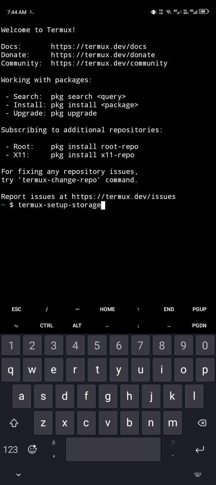
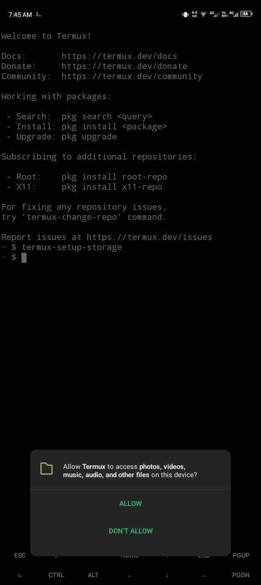
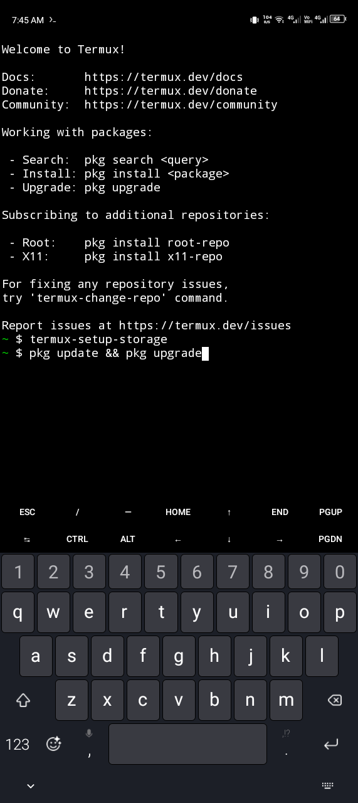
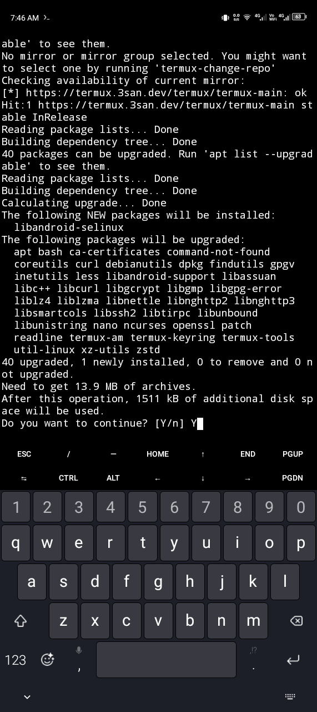
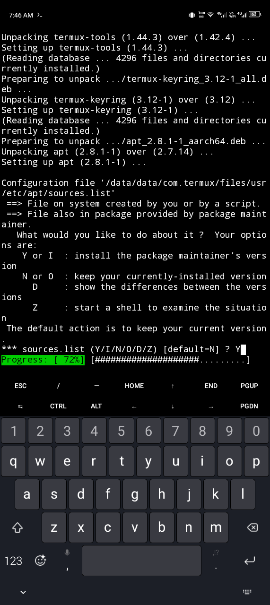

# How to Set Up Yii2 in Termux 📱

## Follow the steps below to install Yii2:

---

### **1. Setup Termux Storage Permission**
Run the following command and allow storage access when prompted:
```bash
termux-setup-storage
```


> **Tip:** Tap **Allow** when prompted.




---

### **2. Update and Upgrade Termux Packages**
```bash
pkg update && pkg upgrade
```
> Using this to ensures all packages are up-to-date.

 



---

### **3. Install Required Packages**
Install PHP, Curl, Git, and Unzip:
```bash
pkg install php curl git unzip
```


---

### **4. Install Composer**
Install the Composer package to download Yii2:
```bash
pkg install composer
```


---

### **5. Verify Composer Installation**
Check if Composer is installed correctly:
```bash
composer --version
```


---

### **6. Create a Directory for Yii2**
Create a new directory named `yii2`:
```bash
mkdir yii2
```


---

### **7. List Files and Folders**
Use the `ls` command to list files:
```bash
ls
```


---

### **8. Navigate to the Directory**
Change to the `yii2` directory:
```bash
cd yii2
```


---

### **9. Install Yii2 Basic Template**
Run the following Composer command to install Yii2 Basic:
```bash
composer create-project --prefer-dist yiisoft/yii2-app-basic yii2-basic
```


---

### **10. Verify Files in the Directory**
List the files in the `yii2-basic` folder:
```bash
ls
```


---

### **11. Change to `yii2-basic` Directory**
Navigate into the Yii2 Basic folder:
```bash
cd yii2-basic
```


---

### **12. List Files Again**
List all files in this folder:
```bash
ls
```


---

### **13. Navigate to the `web` Folder**
Change to the `web` folder where the app runs:
```bash
cd web
```


---

### **14. Start a Local PHP Server**
Run PHP's built-in server on port 8080:
```bash
php -S localhost:8080
```


---

### **15. Access the App in Browser**
Open your browser and visit:
```
http://localhost:8080
```


  # **🎉 TADAA!! Your Yii2 application should now be running locally in port 8080** 


---
